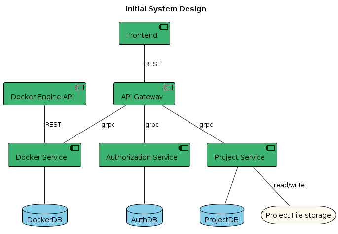

# Dockerized Portfolio

A project portfolio that optimizes system resource usage by utilizing docker to run projects on demand.

## Project Goals

- Create a web application to showcase a portfolio of projects
- Provide an admin panel to add and manage projects
- Allow users to start specific projects by triggering the respective Docker Compose files from the backend
- Intelligently shutdown containers, in order to reduce memory usage

## Requirements

### User Stories for Users

1. Viewing Projects:

   - As a user, I want to see a list of available projects so that I can browse through them.
   - As a user, I want to see detailed information about a specific project when I click on it so that I can understand its purpose and functionality.

2. Starting Projects:

   - As a user, I want to start a project by clicking a "Start" button so that I can interact with the project in a new window or tab.
   - As a user, I want to be notified when a project is successfully started so that I know when it’s ready to use.

3. Navigation:

   - As a user, I want to navigate to a project’s URL automatically after it starts so that I can begin using it without extra steps.
   - As a user, I want an easy way to return to the project list from a project details page so that I can quickly explore other projects.

4. Search and Filtering:
   - As a user, I want to search for projects by name or keywords so that I can quickly find specific projects of interest.
   - As a user, I want to filter projects by category or tags so that I can easily browse through relevant projects.

### User Stories for Admins

1. Managing Projects:

   - As an admin, I want to add new projects to the portfolio by specifying details and uploading/editing a docker-compose file so that they become available to users.
   - As an admin, I want to update existing project details and docker-compose files so that the information remains current and accurate.
   - As an admin, I want to delete projects from the portfolio so that obsolete or unwanted projects are no longer available to users.

2. User Access Control:

   - As an admin, I want to have a secure login to access the admin panel so that only authorized personnel can manage the projects.
   - As an admin, I want to log out of the admin panel securely to prevent unauthorized access.\*\*

3. Monitoring and Notifications:
   - As an admin, I want to monitor the status of all projects (running, stopped, etc.) so that I can manage resources effectively.
   - As an admin, I want to receive notifications if there are issues starting a project so that I can troubleshoot and resolve problems quickly.

## Design

